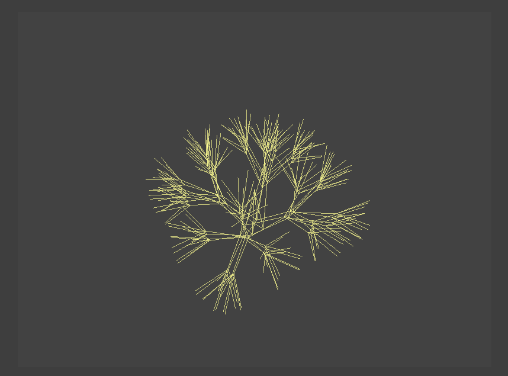
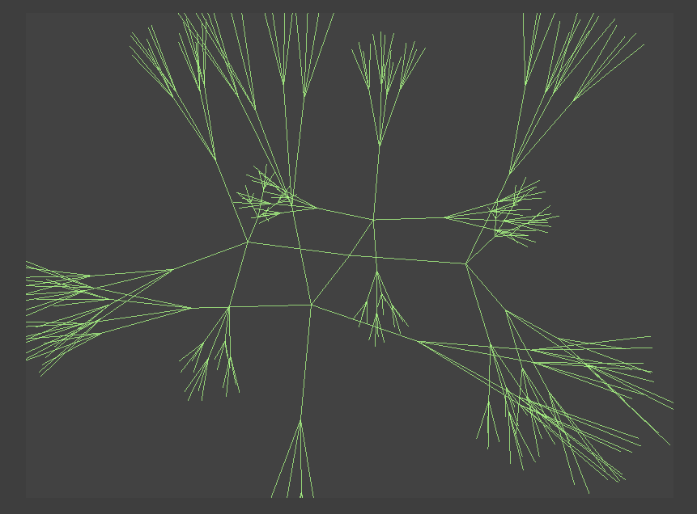
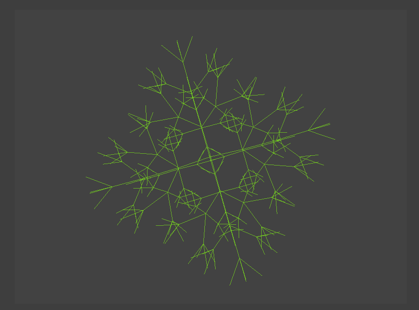

# Random Fractals
This a processing program that creates fractals and allows the user to explore them in 3D. 

This application is hosted here: https://www.openprocessing.org/sketch/486393

This won second place at the BPS Hour of Code 2017 Competition in 3D Modeling

## Examples

